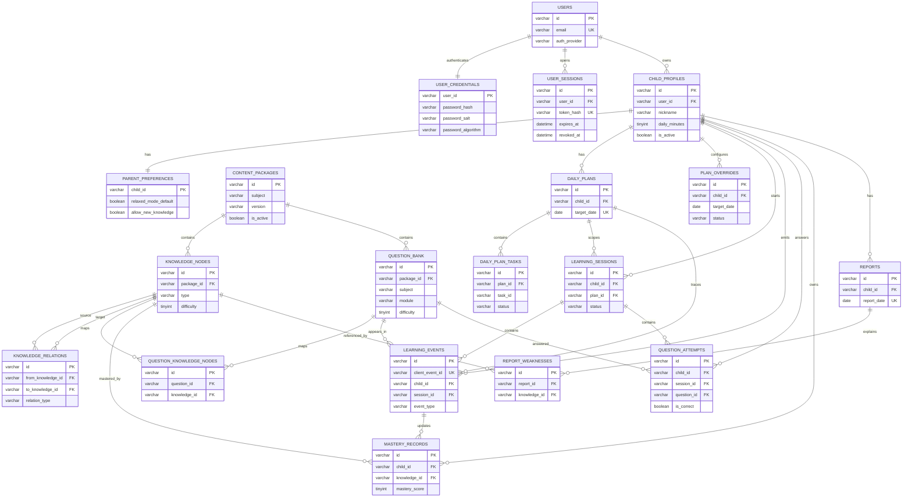

# 幼小衔接 AI 个性化辅导 App 工程设计文档

## 1. 工程目标

本工程根据 PRD 和 Next.js 技术设计文档实现一个本地可运行的 iPad 优先 PWA 原型，覆盖儿童每日旅程、学习任务、AI 计划、家长仪表盘、学情报告和内容后台。

## 2. 技术栈

- Next.js App Router
- React + TypeScript
- Tailwind CSS 4 + 自定义 CSS 设计系统
- MySQL 8.x 服务端持久化：儿童档案、学习事件、掌握度、计划、报告和内容包
- 服务端 API 作为唯一写入入口；浏览器只保留会话级 UI 状态，不保存学习数据
- Web App 安装能力预留：Manifest；Service Worker 只缓存静态壳资源，不缓存学习数据
- Vitest + Testing Library
- Playwright E2E

## 3. 目录说明

```text
src/app                 页面路由和 API Route Handlers
src/components          共享 UI 与客户端交互组件
src/lib                 学习算法、演示数据、报告生成
tests/unit              算法和 API 单元测试
tests/component         React 组件交互测试
tests/e2e               Playwright 端到端测试
public/assets           页面视觉资产
docs                    工程设计、测试用例和测试报告
```

## 4. 页面实现范围

| 路由 | 说明 |
| --- | --- |
| `/login` | 家长建档 |
| `/onboarding` | 跳转到建档页 |
| `/assessment` | 初始测评 |
| `/learn` | 儿童首页：每日旅程 |
| `/learn/tasks/[taskId]` | 识字、拼音、数感任务 |
| `/learn/complete` | 今日成就 |
| `/parent/gate` | 家长验证 |
| `/parent/dashboard` | 家长仪表盘 |
| `/parent/knowledge` | 知识点详情 |
| `/parent/ai-plan` | AI 学习计划预览 |
| `/parent/plan` | 明日计划干预 |
| `/parent/reports/[date]` | 学情报告 |
| `/admin/content` | 内容与知识图谱后台 |

## 5. 核心算法

`src/lib/learning-engine.ts` 提供：

- `updateMastery`：根据答题正确性、耗时、提示次数和连续错误更新掌握度。
- `computeReviewPriority`：根据掌握度、最近练习间隔、错误次数、提示次数计算复习优先级。
- `pickReviewNodes`：选择当天优先复习知识点。
- `pickNewNodes`：基于知识关系选择新知识。
- `generateDailyPlan`：生成每日任务计划，支持轻松模式。
- `generateReport`：生成家长端日报摘要。

## 6. API

| API | 说明 |
| --- | --- |
| `POST /api/auth/register` | 创建家长账号、密码凭据和默认孩子学习数据 |
| `POST /api/auth/login` | 校验邮箱密码，创建服务端会话并写入 HttpOnly Cookie |
| `POST /api/auth/logout` | 注销当前会话 |
| `GET /api/auth/me` | 读取当前登录家长账号 |
| `POST /api/children` | 创建孩子档案和家长偏好 |
| `GET /api/plans/today` | 从 MySQL 读取或生成今日计划 |
| `POST /api/learning/events` | 写入学习事件，按 `clientEventId` 幂等 |
| `GET /api/reports/[date]` | 从事件、掌握度和计划生成或读取指定日期报告 |
| `POST /api/parent/plan-overrides` | 保存家长计划干预，影响明日计划 |

## 7. Web App 安装能力

- `src/app/manifest.ts` 输出 Web App Manifest。
- `public/sw.js` 仅用于静态壳资源缓存，不缓存学习数据或补传事件。
- `src/components/client/pwa-register.tsx` 在浏览器端注册 Service Worker；学习数据仍必须通过 API 写入 MySQL。

## 8. 用户路径与数据流

### 8.1 数据设计原则

- 服务端优先：儿童学习数据统一写入 MySQL，服务端数据库是唯一权威数据源。
- 事件驱动：答题、提示、任务开始和完成先写入学习事件，再在同一服务端事务中派生掌握度、计划进度和报告。
- 在线正常使用优先：学习、报告和计划都依赖服务端 API；网络失败时阻止提交并提示重试。
- 可解释：每日计划、AI 提示和家长报告都能追溯到知识点掌握度、错误事件、提示次数和家长干预。
- 幂等写入：前端每个学习事件生成 `clientEventId`，服务端用唯一索引去重，避免网络重试造成重复计数。
- 隐私可控：儿童数据进入服务端后必须有明确账号、权限、备份和删除策略。

### 8.2 首次使用路径

| 步骤 | 页面/组件 | 用户动作 | 读取数据 | 写入数据 | 后续影响 |
| --- | --- | --- | --- | --- | --- |
| 1 | `/login` 或 `/onboarding` | 家长进入建档 | `child_profiles` | 无 | 判断账号下是否已有活跃孩子档案 |
| 2 | `OnboardingForm` | 填写昵称、年龄阶段、每日时长、目标 | 无 | `child_profiles`、`parent_preferences` | 服务端生成 childId，建立默认家长偏好 |
| 3 | `/assessment` | 进入初始测评 | `question_bank`、`knowledge_nodes` | `learning_sessions` | 建立一条 assessment session |
| 4 | `AssessmentCard` | 完成测评题 | `question_bank` | `learning_events`、`question_attempts`、`mastery_records` | 形成初始掌握度 |
| 5 | `/learn` | 进入儿童首页 | `child_profiles`、`mastery_records`、`plan_overrides`、`daily_plans` | `daily_plans` | 若当天无计划，则服务端调用 `generateDailyPlan` 生成 |

关键约束：

- 建档完成后不能只跳转页面，必须先写入 MySQL；否则刷新或换设备后无法恢复孩子档案。
- 测评结果不能只存在 React state，必须以 `learning_events` 和 `question_attempts` 留痕。
- 初始掌握度由测评事件派生，不能写死到 `demo-data.ts`。
- 建档、测评、学习任务页面都要处理 API 失败状态，不能静默丢数据。

### 8.3 儿童每日学习路径

| 步骤 | 页面/组件 | 用户动作 | 读取数据 | 写入数据 | 派生结果 |
| --- | --- | --- | --- | --- | --- |
| 1 | `/learn` | 打开今日学习 | `daily_plans`、`child_profiles`、`mastery_records` | 必要时写入 `daily_plans` | 展示今日任务、进度和时长 |
| 2 | `/learn/tasks/[taskId]` | 进入任务 | `daily_plans`、`question_bank`、`question_attempts` | `learning_sessions`、`learning_events(session_started/task_started)` | 记录任务开始 |
| 3 | `TaskPractice` | 作答、请求提示、换题 | `question_bank`、`mastery_records` | `learning_events(item_answered/hint_shown)`、`question_attempts` | 更新题目级记录 |
| 4 | `learning-engine` | 计算掌握度 | `mastery_records`、本次事件 | `mastery_records` | 更新正确数、错误数、提示数、掌握分 |
| 5 | `TaskPractice` | 完成任务 | `daily_plans` | `learning_events(task_completed)`、`daily_plans` | 更新任务进度 |
| 6 | `/learn/complete` | 查看今日完成 | `daily_plans`、`learning_events`、`mastery_records` | `reports` | 生成当天学习摘要 |

数感游戏的事件要求：

- 每次题目展示写入 `item_presented` 或在 `task_started` payload 中记录题目序列。
- 每次选择写入 `item_answered`，payload 包含 `questionId`、`selectedAnswer`、`correctAnswer`、`isCorrect`、`durationMs`、`hintCount`。
- 每次提示写入 `hint_shown`，payload 包含 `hintLevel`、`hintTextKey`、`questionId`。
- 如果孩子连续错误，`wrongStreak` 进入 `item_answered` payload，供 `updateMastery` 降低掌握度。

### 8.4 家长查看与干预路径

| 步骤 | 页面/组件 | 用户动作 | 读取数据 | 写入数据 | 后续影响 |
| --- | --- | --- | --- | --- | --- |
| 1 | `/parent/gate` | 进入家长入口 | `parent_preferences` | 可写 `ui_state` | 降低儿童误触家长端概率 |
| 2 | `/parent/dashboard` | 查看整体进展 | `child_profiles`、`mastery_records`、`daily_plans`、`reports` | 无 | 展示学习时长、薄弱点、连续天数 |
| 3 | `/parent/reports/[date]` | 查看日报 | `reports`、`learning_events`、`question_attempts` | 无或按需重算 `reports` | 报告薄弱点可追溯到事件 |
| 4 | `/parent/knowledge` | 查看知识点详情 | `knowledge_nodes`、`mastery_records`、`question_attempts` | 无 | 展示错误题型、最近练习 |
| 5 | `/parent/plan` | 调整明日计划 | `daily_plans`、`mastery_records`、`plan_overrides` | `plan_overrides`、`daily_plans` | 明日计划重新生成 |
| 6 | `/parent/ai-plan` | 预览 AI 计划依据 | `daily_plans`、`mastery_records`、`plan_overrides` | 无 | 展示“为什么安排这些任务” |

家长干预必须持久化为 `plan_overrides`，不能只保存在 `PlanEditor` 的组件状态里。比如轻松模式、暂停新知识、每日时长变更，都要影响下一次 `generateDailyPlan`。

### 8.5 正常在线使用与失败处理

| 场景 | 客户端行为 | 服务端行为 | 失败处理 |
| --- | --- | --- | --- |
| 网络正常 | 每个关键动作立即调用 API | 写入 MySQL 并返回最新计划/进度 | 前端展示成功反馈 |
| 请求超时 | 保留当前页面状态，允许重试同一 `clientEventId` | 通过唯一索引避免重复事件 | 明确提示“网络不稳定，请重试” |
| 重复点击提交 | 前端按钮进入 loading 并禁用；若仍重复请求，沿用同一 `clientEventId` | 命中幂等唯一索引，只处理一次 | 返回同一处理结果 |
| 刷新或重开应用 | 重新从 API 拉取档案、计划、进度 | MySQL 返回权威状态 | 若 API 不可用，展示错误页并提供重试 |
| 内容包更新 | 客户端重新拉取题库版本 | MySQL 保留内容版本和历史作答引用 | 题目记录必须保留 `content_version` |

当前学习事件统一通过 `POST /api/learning/events` 写入，在服务端事务中写入事件、题目记录、掌握度和计划进度。

## 9. MySQL 数据库设计

### 9.1 基本信息

| 项 | 设计 |
| --- | --- |
| 数据库 | MySQL 8.x |
| 存储引擎 | InnoDB |
| 字符集 | `utf8mb4` |
| 排序规则 | `utf8mb4_0900_ai_ci` |
| 主键风格 | 业务表使用字符串 ID，推荐 ULID 或 UUIDv7，便于日志追踪 |
| 时间格式 | `DATETIME(3)`，统一存 UTC |
| JSON 字段 | 题目展示、事件 payload、计划生成依据等使用 MySQL `JSON` |
| 删除策略 | 默认软删除，字段为 `deleted_at` |
| 幂等键 | `learning_events.client_event_id` 唯一 |

ID 约定：

| 类型 | 示例 |
| --- | --- |
| `childId` | `child_01JZ8M6Q9N8Y3W8K3A0X7P2Q4B` |
| `sessionId` | `sess_01JZ8M9QK6R5T9H4E2J1P6W8DA` |
| `clientEventId` | `evt_01JZ8MA8V8Z8M2D4QK0R9C1P7H` |
| `planId` | `plan_child_..._2026-06-19` |
| `attemptId` | `attempt_01JZ8MBF1S4G7K9Q8K6N2H5P0V` |
| `reportId` | `report_child_..._2026-06-19` |

### 9.2 表总览

| 表 | 主键 | 主要用途 | 关键索引 |
| --- | --- | --- | --- |
| `users` | `id` | 家长账号主体 | `email` unique |
| `user_credentials` | `user_id` | 密码登录凭据，只保存盐和哈希 | `user_id` PK |
| `user_sessions` | `id` | 登录会话，Cookie 保存明文 token，数据库只保存哈希 | `token_hash` unique、`user_id,expires_at` |
| `child_profiles` | `id` | 孩子档案 | `user_id`、`is_active` |
| `parent_preferences` | `child_id` | 家长偏好和门禁设置 | `updated_at` |
| `content_packages` | `id` | 内容包版本和启用状态 | `subject`、`version`、`is_active` |
| `knowledge_nodes` | `id` | 汉字、拼音、数感知识点 | `type`、`difficulty`、`content_version` |
| `knowledge_relations` | `id` | 知识点前置和关联关系 | `from_knowledge_id`、`to_knowledge_id` |
| `question_bank` | `id` | 题库内容，包括数感题 | `module`、`difficulty`、`content_version` |
| `question_knowledge_nodes` | `id` | 题目和知识点多对多关系 | `question_id`、`knowledge_id` |
| `daily_plans` | `id` | 每日计划快照 | `child_id,target_date` unique |
| `daily_plan_tasks` | `id` | 每日计划中的任务明细 | `plan_id`、`task_id` |
| `plan_overrides` | `id` | 家长调整和 AI 计划干预 | `child_id,target_date,status` |
| `learning_sessions` | `id` | 一次测评或学习任务 session | `child_id,started_at`、`status` |
| `learning_events` | `id` | 所有学习事件的事实日志 | `client_event_id` unique、`child_id,created_at` |
| `question_attempts` | `id` | 题目级作答记录 | `child_id,question_id`、`session_id` |
| `mastery_records` | `id` | 知识点掌握度快照 | `child_id,knowledge_id` unique |
| `reports` | `id` | 每日/周期报告快照 | `child_id,report_date` unique |
| `report_weaknesses` | `id` | 报告中的薄弱点证据 | `report_id`、`knowledge_id` |

#### ER 图



#### ER 关系说明

| 业务域 | 主关系 | 基数 | 设计含义 |
| --- | --- | --- | --- |
| 账号鉴权 | `users` -> `user_credentials`、`user_sessions` | 1:1 / 1:N | 家长账号和密码凭据分表；会话表只存 token 哈希，支持多端登录、过期和注销 |
| 账号与孩子 | `users` -> `child_profiles` | 1:N | 一个家长账号可以管理多个孩子，MVP 先默认一个活跃孩子 |
| 孩子偏好 | `child_profiles` -> `parent_preferences` | 1:1 | 每个孩子一份家长偏好，控制每日时长、轻松模式和家长门禁 |
| 内容包 | `content_packages` -> `knowledge_nodes`、`question_bank` | 1:N | 内容按学科和版本管理，题目与知识点保留内容版本，便于历史追溯 |
| 知识图谱 | `knowledge_nodes` -> `knowledge_relations` | 1:N | 前置、关联、易混关系单独建表，避免把可查询关系塞进 JSON |
| 题目映射 | `question_bank` 与 `knowledge_nodes` | M:N | 通过 `question_knowledge_nodes` 关联，一道题可覆盖多个知识点 |
| 每日计划 | `child_profiles` -> `daily_plans` -> `daily_plan_tasks` | 1:N:N | 每天一份计划快照，任务明细保存题目序列、知识点和进度 |
| 家长干预 | `child_profiles` -> `plan_overrides` | 1:N | 轻松模式、暂停新知识、指定复习点等干预独立留痕 |
| 学习过程 | `child_profiles` -> `learning_sessions` -> `learning_events` | 1:N:N | session 表示一次测评或任务，event 表示不可变事实日志 |
| 题目作答 | `learning_sessions` -> `question_attempts` | 1:N | 高频作答明细从事件中拆出，方便错题、正确率和耗时统计 |
| 掌握度 | `child_profiles` + `knowledge_nodes` -> `mastery_records` | N:1:N | 每个孩子每个知识点只有一条掌握度快照，由作答事件派生 |
| 报告 | `child_profiles` -> `reports` -> `report_weaknesses` | 1:N:N | 报告保存生成快照，薄弱点保留知识点和证据事件 ID |

关键读写链路：

1. 注册登录链路：`users`、`user_credentials`、`user_sessions`。
2. 建档链路：`users`、`child_profiles`、`parent_preferences`。
3. 内容链路：`content_packages`、`knowledge_nodes`、`knowledge_relations`、`question_bank`、`question_knowledge_nodes`。
4. 计划链路：`mastery_records`、`plan_overrides` 生成 `daily_plans` 和 `daily_plan_tasks`。
5. 学习链路：`learning_sessions` 记录上下文，`learning_events` 记录事实，`question_attempts` 记录答题明细，`mastery_records` 更新掌握度。
6. 报告链路：`learning_events`、`question_attempts`、`mastery_records` 汇总生成 `reports` 和 `report_weaknesses`。

#### 表结构分层

| 分层 | 数据表 | 读写特征 |
| --- | --- | --- |
| 账号鉴权层 | `users`、`user_credentials`、`user_sessions` | 注册低频写入，登录校验和会话读取高频 |
| 孩子档案层 | `child_profiles`、`parent_preferences` | 低频写入，高频读取当前孩子和偏好 |
| 内容题库层 | `content_packages`、`knowledge_nodes`、`knowledge_relations`、`question_bank`、`question_knowledge_nodes` | 后台低频更新，学习页高频读取 |
| 计划编排层 | `daily_plans`、`daily_plan_tasks`、`plan_overrides` | 每天生成或家长干预时写入，儿童首页高频读取 |
| 学习事实层 | `learning_sessions`、`learning_events`、`question_attempts` | 学习过程中高频写入，是掌握度和报告的事实来源 |
| 派生结果层 | `mastery_records`、`reports`、`report_weaknesses` | 由学习事实派生，供计划、报告和家长看板读取 |

#### MySQL DDL

以下 DDL 是当前设计的落库基线。生产环境建议通过迁移工具执行，并为外键删除策略、审计字段和账号系统接入做环境化调整。

```sql
CREATE TABLE users (
  id VARCHAR(36) NOT NULL,
  email VARCHAR(191) NULL,
  display_name VARCHAR(64) NULL,
  auth_provider VARCHAR(32) NOT NULL DEFAULT 'anonymous',
  created_at DATETIME(3) NOT NULL DEFAULT CURRENT_TIMESTAMP(3),
  updated_at DATETIME(3) NOT NULL DEFAULT CURRENT_TIMESTAMP(3) ON UPDATE CURRENT_TIMESTAMP(3),
  deleted_at DATETIME(3) NULL,
  PRIMARY KEY (id),
  UNIQUE KEY uk_users_email (email)
) ENGINE=InnoDB DEFAULT CHARSET=utf8mb4 COLLATE=utf8mb4_0900_ai_ci;

CREATE TABLE user_credentials (
  user_id VARCHAR(36) NOT NULL,
  password_hash VARCHAR(255) NOT NULL,
  password_salt VARCHAR(64) NOT NULL,
  password_algorithm VARCHAR(32) NOT NULL DEFAULT 'scrypt-sha256-v1',
  created_at DATETIME(3) NOT NULL DEFAULT CURRENT_TIMESTAMP(3),
  updated_at DATETIME(3) NOT NULL DEFAULT CURRENT_TIMESTAMP(3) ON UPDATE CURRENT_TIMESTAMP(3),
  PRIMARY KEY (user_id),
  CONSTRAINT fk_user_credentials_user
    FOREIGN KEY (user_id) REFERENCES users(id)
    ON DELETE CASCADE
) ENGINE=InnoDB DEFAULT CHARSET=utf8mb4 COLLATE=utf8mb4_0900_ai_ci;

CREATE TABLE user_sessions (
  id VARCHAR(36) NOT NULL,
  user_id VARCHAR(36) NOT NULL,
  token_hash VARCHAR(64) NOT NULL,
  user_agent VARCHAR(255) NULL,
  expires_at DATETIME(3) NOT NULL,
  created_at DATETIME(3) NOT NULL DEFAULT CURRENT_TIMESTAMP(3),
  last_seen_at DATETIME(3) NULL,
  revoked_at DATETIME(3) NULL,
  PRIMARY KEY (id),
  UNIQUE KEY uk_user_sessions_token_hash (token_hash),
  KEY idx_user_sessions_user_expires (user_id, expires_at),
  CONSTRAINT fk_user_sessions_user
    FOREIGN KEY (user_id) REFERENCES users(id)
    ON DELETE CASCADE
) ENGINE=InnoDB DEFAULT CHARSET=utf8mb4 COLLATE=utf8mb4_0900_ai_ci;

CREATE TABLE child_profiles (
  id VARCHAR(36) NOT NULL,
  user_id VARCHAR(36) NOT NULL,
  nickname VARCHAR(64) NOT NULL,
  age_band VARCHAR(16) NOT NULL,
  stage VARCHAR(32) NOT NULL,
  daily_minutes TINYINT UNSIGNED NOT NULL,
  goals JSON NOT NULL,
  baseline JSON NULL,
  is_active BOOLEAN NOT NULL DEFAULT TRUE,
  created_at DATETIME(3) NOT NULL DEFAULT CURRENT_TIMESTAMP(3),
  updated_at DATETIME(3) NOT NULL DEFAULT CURRENT_TIMESTAMP(3) ON UPDATE CURRENT_TIMESTAMP(3),
  deleted_at DATETIME(3) NULL,
  PRIMARY KEY (id),
  KEY idx_child_profiles_user_active (user_id, is_active),
  CONSTRAINT fk_child_profiles_user
    FOREIGN KEY (user_id) REFERENCES users(id)
) ENGINE=InnoDB DEFAULT CHARSET=utf8mb4 COLLATE=utf8mb4_0900_ai_ci;

CREATE TABLE parent_preferences (
  child_id VARCHAR(36) NOT NULL,
  gate_type VARCHAR(32) NOT NULL DEFAULT 'hold_button',
  relaxed_mode_default BOOLEAN NOT NULL DEFAULT FALSE,
  report_push_enabled BOOLEAN NOT NULL DEFAULT TRUE,
  allow_new_knowledge BOOLEAN NOT NULL DEFAULT TRUE,
  max_daily_minutes TINYINT UNSIGNED NOT NULL DEFAULT 20,
  created_at DATETIME(3) NOT NULL DEFAULT CURRENT_TIMESTAMP(3),
  updated_at DATETIME(3) NOT NULL DEFAULT CURRENT_TIMESTAMP(3) ON UPDATE CURRENT_TIMESTAMP(3),
  PRIMARY KEY (child_id),
  KEY idx_parent_preferences_updated_at (updated_at),
  CONSTRAINT fk_parent_preferences_child
    FOREIGN KEY (child_id) REFERENCES child_profiles(id)
    ON DELETE CASCADE
) ENGINE=InnoDB DEFAULT CHARSET=utf8mb4 COLLATE=utf8mb4_0900_ai_ci;

CREATE TABLE content_packages (
  id VARCHAR(36) NOT NULL,
  subject VARCHAR(16) NOT NULL,
  version VARCHAR(32) NOT NULL,
  title VARCHAR(128) NOT NULL,
  description VARCHAR(500) NULL,
  is_active BOOLEAN NOT NULL DEFAULT FALSE,
  created_at DATETIME(3) NOT NULL DEFAULT CURRENT_TIMESTAMP(3),
  updated_at DATETIME(3) NOT NULL DEFAULT CURRENT_TIMESTAMP(3) ON UPDATE CURRENT_TIMESTAMP(3),
  PRIMARY KEY (id),
  UNIQUE KEY uk_content_packages_subject_version (subject, version),
  KEY idx_content_packages_subject_active (subject, is_active)
) ENGINE=InnoDB DEFAULT CHARSET=utf8mb4 COLLATE=utf8mb4_0900_ai_ci;

CREATE TABLE knowledge_nodes (
  id VARCHAR(36) NOT NULL,
  package_id VARCHAR(36) NOT NULL,
  type VARCHAR(16) NOT NULL,
  title VARCHAR(128) NOT NULL,
  meaning VARCHAR(255) NOT NULL,
  pinyin VARCHAR(64) NULL,
  difficulty TINYINT UNSIGNED NOT NULL,
  content_version VARCHAR(32) NOT NULL,
  enabled BOOLEAN NOT NULL DEFAULT TRUE,
  created_at DATETIME(3) NOT NULL DEFAULT CURRENT_TIMESTAMP(3),
  updated_at DATETIME(3) NOT NULL DEFAULT CURRENT_TIMESTAMP(3) ON UPDATE CURRENT_TIMESTAMP(3),
  PRIMARY KEY (id),
  KEY idx_knowledge_nodes_type_difficulty (type, difficulty),
  KEY idx_knowledge_nodes_content_version (content_version),
  CONSTRAINT fk_knowledge_nodes_package
    FOREIGN KEY (package_id) REFERENCES content_packages(id)
) ENGINE=InnoDB DEFAULT CHARSET=utf8mb4 COLLATE=utf8mb4_0900_ai_ci;

CREATE TABLE knowledge_relations (
  id VARCHAR(36) NOT NULL,
  from_knowledge_id VARCHAR(36) NOT NULL,
  to_knowledge_id VARCHAR(36) NOT NULL,
  relation_type VARCHAR(32) NOT NULL,
  PRIMARY KEY (id),
  UNIQUE KEY uk_knowledge_relations_pair (from_knowledge_id, to_knowledge_id, relation_type),
  KEY idx_knowledge_relations_to (to_knowledge_id),
  CONSTRAINT fk_knowledge_relations_from
    FOREIGN KEY (from_knowledge_id) REFERENCES knowledge_nodes(id)
    ON DELETE CASCADE,
  CONSTRAINT fk_knowledge_relations_to
    FOREIGN KEY (to_knowledge_id) REFERENCES knowledge_nodes(id)
    ON DELETE CASCADE
) ENGINE=InnoDB DEFAULT CHARSET=utf8mb4 COLLATE=utf8mb4_0900_ai_ci;

CREATE TABLE question_bank (
  id VARCHAR(36) NOT NULL,
  package_id VARCHAR(36) NOT NULL,
  subject VARCHAR(16) NOT NULL,
  module VARCHAR(32) NOT NULL,
  prompt VARCHAR(500) NOT NULL,
  display JSON NOT NULL,
  choices JSON NULL,
  answer JSON NOT NULL,
  hint_levels JSON NOT NULL,
  difficulty TINYINT UNSIGNED NOT NULL,
  estimated_seconds SMALLINT UNSIGNED NOT NULL,
  content_version VARCHAR(32) NOT NULL,
  enabled BOOLEAN NOT NULL DEFAULT TRUE,
  created_at DATETIME(3) NOT NULL DEFAULT CURRENT_TIMESTAMP(3),
  updated_at DATETIME(3) NOT NULL DEFAULT CURRENT_TIMESTAMP(3) ON UPDATE CURRENT_TIMESTAMP(3),
  PRIMARY KEY (id),
  KEY idx_question_bank_subject_module_difficulty (subject, module, difficulty),
  KEY idx_question_bank_content_version (content_version),
  CONSTRAINT fk_question_bank_package
    FOREIGN KEY (package_id) REFERENCES content_packages(id)
) ENGINE=InnoDB DEFAULT CHARSET=utf8mb4 COLLATE=utf8mb4_0900_ai_ci;

CREATE TABLE question_knowledge_nodes (
  id VARCHAR(36) NOT NULL,
  question_id VARCHAR(36) NOT NULL,
  knowledge_id VARCHAR(36) NOT NULL,
  PRIMARY KEY (id),
  UNIQUE KEY uk_question_knowledge_nodes_pair (question_id, knowledge_id),
  KEY idx_question_knowledge_nodes_knowledge (knowledge_id),
  CONSTRAINT fk_question_knowledge_nodes_question
    FOREIGN KEY (question_id) REFERENCES question_bank(id)
    ON DELETE CASCADE,
  CONSTRAINT fk_question_knowledge_nodes_knowledge
    FOREIGN KEY (knowledge_id) REFERENCES knowledge_nodes(id)
    ON DELETE CASCADE
) ENGINE=InnoDB DEFAULT CHARSET=utf8mb4 COLLATE=utf8mb4_0900_ai_ci;

CREATE TABLE daily_plans (
  id VARCHAR(36) NOT NULL,
  child_id VARCHAR(36) NOT NULL,
  target_date DATE NOT NULL,
  total_minutes SMALLINT UNSIGNED NOT NULL,
  headline VARCHAR(128) NOT NULL,
  reason JSON NOT NULL,
  source VARCHAR(32) NOT NULL,
  generated_from JSON NOT NULL,
  created_at DATETIME(3) NOT NULL DEFAULT CURRENT_TIMESTAMP(3),
  updated_at DATETIME(3) NOT NULL DEFAULT CURRENT_TIMESTAMP(3) ON UPDATE CURRENT_TIMESTAMP(3),
  PRIMARY KEY (id),
  UNIQUE KEY uk_daily_plans_child_date (child_id, target_date),
  CONSTRAINT fk_daily_plans_child
    FOREIGN KEY (child_id) REFERENCES child_profiles(id)
    ON DELETE CASCADE
) ENGINE=InnoDB DEFAULT CHARSET=utf8mb4 COLLATE=utf8mb4_0900_ai_ci;

CREATE TABLE daily_plan_tasks (
  id VARCHAR(36) NOT NULL,
  plan_id VARCHAR(36) NOT NULL,
  task_id VARCHAR(64) NOT NULL,
  type VARCHAR(16) NOT NULL,
  title VARCHAR(128) NOT NULL,
  description VARCHAR(255) NOT NULL,
  minutes SMALLINT UNSIGNED NOT NULL,
  progress SMALLINT UNSIGNED NOT NULL DEFAULT 0,
  total SMALLINT UNSIGNED NOT NULL,
  knowledge_ids JSON NOT NULL,
  question_ids JSON NOT NULL,
  status VARCHAR(16) NOT NULL DEFAULT 'not_started',
  sort_order SMALLINT UNSIGNED NOT NULL,
  PRIMARY KEY (id),
  KEY idx_daily_plan_tasks_plan_order (plan_id, sort_order),
  KEY idx_daily_plan_tasks_task_id (task_id),
  CONSTRAINT fk_daily_plan_tasks_plan
    FOREIGN KEY (plan_id) REFERENCES daily_plans(id)
    ON DELETE CASCADE
) ENGINE=InnoDB DEFAULT CHARSET=utf8mb4 COLLATE=utf8mb4_0900_ai_ci;

CREATE TABLE plan_overrides (
  id VARCHAR(36) NOT NULL,
  child_id VARCHAR(36) NOT NULL,
  target_date DATE NOT NULL,
  relaxed_mode BOOLEAN NULL,
  pause_new_knowledge BOOLEAN NULL,
  daily_minutes TINYINT UNSIGNED NULL,
  focus_knowledge_ids JSON NULL,
  status VARCHAR(16) NOT NULL DEFAULT 'active',
  reason VARCHAR(255) NULL,
  created_at DATETIME(3) NOT NULL DEFAULT CURRENT_TIMESTAMP(3),
  updated_at DATETIME(3) NOT NULL DEFAULT CURRENT_TIMESTAMP(3) ON UPDATE CURRENT_TIMESTAMP(3),
  PRIMARY KEY (id),
  KEY idx_plan_overrides_child_date_status (child_id, target_date, status),
  CONSTRAINT fk_plan_overrides_child
    FOREIGN KEY (child_id) REFERENCES child_profiles(id)
    ON DELETE CASCADE
) ENGINE=InnoDB DEFAULT CHARSET=utf8mb4 COLLATE=utf8mb4_0900_ai_ci;

CREATE TABLE learning_sessions (
  id VARCHAR(36) NOT NULL,
  child_id VARCHAR(36) NOT NULL,
  mode VARCHAR(16) NOT NULL,
  task_id VARCHAR(64) NULL,
  plan_id VARCHAR(36) NULL,
  subject VARCHAR(16) NULL,
  started_at DATETIME(3) NOT NULL,
  ended_at DATETIME(3) NULL,
  status VARCHAR(16) NOT NULL DEFAULT 'active',
  device_info JSON NULL,
  PRIMARY KEY (id),
  KEY idx_learning_sessions_child_started (child_id, started_at),
  KEY idx_learning_sessions_status (status),
  KEY idx_learning_sessions_plan (plan_id),
  CONSTRAINT fk_learning_sessions_child
    FOREIGN KEY (child_id) REFERENCES child_profiles(id)
    ON DELETE CASCADE,
  CONSTRAINT fk_learning_sessions_plan
    FOREIGN KEY (plan_id) REFERENCES daily_plans(id)
    ON DELETE SET NULL
) ENGINE=InnoDB DEFAULT CHARSET=utf8mb4 COLLATE=utf8mb4_0900_ai_ci;

CREATE TABLE learning_events (
  id VARCHAR(36) NOT NULL,
  client_event_id VARCHAR(64) NOT NULL,
  child_id VARCHAR(36) NOT NULL,
  session_id VARCHAR(36) NOT NULL,
  plan_id VARCHAR(36) NULL,
  task_id VARCHAR(64) NULL,
  question_id VARCHAR(36) NULL,
  event_type VARCHAR(32) NOT NULL,
  knowledge_ids JSON NOT NULL,
  payload JSON NOT NULL,
  created_at DATETIME(3) NOT NULL,
  server_received_at DATETIME(3) NOT NULL DEFAULT CURRENT_TIMESTAMP(3),
  PRIMARY KEY (id),
  UNIQUE KEY uk_learning_events_client_event_id (client_event_id),
  KEY idx_learning_events_child_created (child_id, created_at),
  KEY idx_learning_events_session_created (session_id, created_at),
  KEY idx_learning_events_plan (plan_id),
  KEY idx_learning_events_question (question_id),
  CONSTRAINT fk_learning_events_child
    FOREIGN KEY (child_id) REFERENCES child_profiles(id)
    ON DELETE CASCADE,
  CONSTRAINT fk_learning_events_session
    FOREIGN KEY (session_id) REFERENCES learning_sessions(id)
    ON DELETE CASCADE,
  CONSTRAINT fk_learning_events_plan
    FOREIGN KEY (plan_id) REFERENCES daily_plans(id)
    ON DELETE SET NULL,
  CONSTRAINT fk_learning_events_question
    FOREIGN KEY (question_id) REFERENCES question_bank(id)
    ON DELETE SET NULL
) ENGINE=InnoDB DEFAULT CHARSET=utf8mb4 COLLATE=utf8mb4_0900_ai_ci;

CREATE TABLE question_attempts (
  id VARCHAR(36) NOT NULL,
  child_id VARCHAR(36) NOT NULL,
  session_id VARCHAR(36) NOT NULL,
  task_id VARCHAR(64) NOT NULL,
  question_id VARCHAR(36) NOT NULL,
  knowledge_ids JSON NOT NULL,
  selected_answer JSON NOT NULL,
  correct_answer JSON NOT NULL,
  is_correct BOOLEAN NOT NULL,
  duration_ms INT UNSIGNED NOT NULL,
  hint_count TINYINT UNSIGNED NOT NULL DEFAULT 0,
  attempt_index SMALLINT UNSIGNED NOT NULL,
  created_at DATETIME(3) NOT NULL,
  PRIMARY KEY (id),
  KEY idx_question_attempts_child_question_created (child_id, question_id, created_at),
  KEY idx_question_attempts_session (session_id),
  KEY idx_question_attempts_question (question_id),
  CONSTRAINT fk_question_attempts_child
    FOREIGN KEY (child_id) REFERENCES child_profiles(id)
    ON DELETE CASCADE,
  CONSTRAINT fk_question_attempts_session
    FOREIGN KEY (session_id) REFERENCES learning_sessions(id)
    ON DELETE CASCADE,
  CONSTRAINT fk_question_attempts_question
    FOREIGN KEY (question_id) REFERENCES question_bank(id)
    ON DELETE RESTRICT
) ENGINE=InnoDB DEFAULT CHARSET=utf8mb4 COLLATE=utf8mb4_0900_ai_ci;

CREATE TABLE mastery_records (
  id VARCHAR(36) NOT NULL,
  child_id VARCHAR(36) NOT NULL,
  knowledge_id VARCHAR(36) NOT NULL,
  type VARCHAR(16) NOT NULL,
  mastery_score TINYINT UNSIGNED NOT NULL,
  exposure_count INT UNSIGNED NOT NULL DEFAULT 0,
  correct_count INT UNSIGNED NOT NULL DEFAULT 0,
  wrong_count INT UNSIGNED NOT NULL DEFAULT 0,
  hint_count INT UNSIGNED NOT NULL DEFAULT 0,
  last_practiced_at DATETIME(3) NULL,
  weakness_tags JSON NOT NULL,
  updated_from_event_id VARCHAR(36) NULL,
  created_at DATETIME(3) NOT NULL DEFAULT CURRENT_TIMESTAMP(3),
  updated_at DATETIME(3) NOT NULL DEFAULT CURRENT_TIMESTAMP(3) ON UPDATE CURRENT_TIMESTAMP(3),
  PRIMARY KEY (id),
  UNIQUE KEY uk_mastery_records_child_knowledge (child_id, knowledge_id),
  KEY idx_mastery_records_knowledge (knowledge_id),
  KEY idx_mastery_records_updated_event (updated_from_event_id),
  CONSTRAINT fk_mastery_records_child
    FOREIGN KEY (child_id) REFERENCES child_profiles(id)
    ON DELETE CASCADE,
  CONSTRAINT fk_mastery_records_knowledge
    FOREIGN KEY (knowledge_id) REFERENCES knowledge_nodes(id)
    ON DELETE RESTRICT,
  CONSTRAINT fk_mastery_records_updated_event
    FOREIGN KEY (updated_from_event_id) REFERENCES learning_events(id)
    ON DELETE SET NULL
) ENGINE=InnoDB DEFAULT CHARSET=utf8mb4 COLLATE=utf8mb4_0900_ai_ci;

CREATE TABLE reports (
  id VARCHAR(36) NOT NULL,
  child_id VARCHAR(36) NOT NULL,
  report_date DATE NOT NULL,
  summary TEXT NOT NULL,
  strengths JSON NOT NULL,
  tomorrow_suggestion TEXT NOT NULL,
  stats JSON NOT NULL,
  generated_from JSON NOT NULL,
  generated_at DATETIME(3) NOT NULL,
  PRIMARY KEY (id),
  UNIQUE KEY uk_reports_child_date (child_id, report_date),
  CONSTRAINT fk_reports_child
    FOREIGN KEY (child_id) REFERENCES child_profiles(id)
    ON DELETE CASCADE
) ENGINE=InnoDB DEFAULT CHARSET=utf8mb4 COLLATE=utf8mb4_0900_ai_ci;

CREATE TABLE report_weaknesses (
  id VARCHAR(36) NOT NULL,
  report_id VARCHAR(36) NOT NULL,
  knowledge_id VARCHAR(36) NOT NULL,
  title VARCHAR(128) NOT NULL,
  reason VARCHAR(500) NOT NULL,
  evidence_event_ids JSON NOT NULL,
  PRIMARY KEY (id),
  KEY idx_report_weaknesses_report (report_id),
  KEY idx_report_weaknesses_knowledge (knowledge_id),
  CONSTRAINT fk_report_weaknesses_report
    FOREIGN KEY (report_id) REFERENCES reports(id)
    ON DELETE CASCADE,
  CONSTRAINT fk_report_weaknesses_knowledge
    FOREIGN KEY (knowledge_id) REFERENCES knowledge_nodes(id)
    ON DELETE RESTRICT
) ENGINE=InnoDB DEFAULT CHARSET=utf8mb4 COLLATE=utf8mb4_0900_ai_ci;
```

### 9.3 数据表结构明细

本节是研发评审使用的数据字典。字段列表描述业务含义；主键、外键、唯一约束和索引以 9.2 的 DDL 与 9.4 的索引表为准。

字段约定：

| 约定 | 说明 |
| --- | --- |
| `id` | 字符串主键，推荐服务端生成 ULID 或 UUIDv7 |
| `created_at`、`updated_at` | 审计时间，统一使用 `DATETIME(3)` 和 UTC |
| `deleted_at` | 软删除时间；学习事实表默认不软删除，避免破坏追溯 |
| `JSON` 字段 | 保存结构化快照，如题目展示、答案、计划依据、报告统计 |
| `content_version` | 内容版本快照，保证内容包更新后历史作答仍可解释 |
| `client_event_id` | 前端事件幂等键，网络重试时必须保持不变 |

#### `users`

| 字段 | 类型 | 说明 |
| --- | --- | --- |
| `id` | `varchar(36)` | 家长用户 ID |
| `email` | `varchar(191) null` | 后续真实登录使用，唯一 |
| `display_name` | `varchar(64) null` | 家长展示名 |
| `auth_provider` | `varchar(32)` | `anonymous`、`password`、`wechat` 等 |
| `created_at` | `datetime(3)` | 创建时间 |
| `updated_at` | `datetime(3)` | 更新时间 |
| `deleted_at` | `datetime(3) null` | 软删除时间 |

#### `user_credentials`

| 字段 | 类型 | 说明 |
| --- | --- | --- |
| `user_id` | `varchar(36)` | 主键，同时外键到 `users.id` |
| `password_hash` | `varchar(255)` | 密码哈希值，不保存明文密码 |
| `password_salt` | `varchar(64)` | 每个账号独立盐值 |
| `password_algorithm` | `varchar(32)` | 当前为 `scrypt-sha256-v1`，用于后续算法升级 |
| `created_at` | `datetime(3)` | 创建时间 |
| `updated_at` | `datetime(3)` | 更新时间 |

注册时先写 `users`，再写 `user_credentials`。登录时通过邮箱找到账号和凭据，在服务端用同一算法校验密码。

#### `user_sessions`

| 字段 | 类型 | 说明 |
| --- | --- | --- |
| `id` | `varchar(36)` | 会话 ID |
| `user_id` | `varchar(36)` | 所属家长账号 |
| `token_hash` | `varchar(64)` | 会话 token 的 SHA-256 哈希，唯一；Cookie 保存原始 token |
| `user_agent` | `varchar(255) null` | 登录设备或浏览器摘要 |
| `expires_at` | `datetime(3)` | 会话过期时间 |
| `created_at` | `datetime(3)` | 创建时间 |
| `last_seen_at` | `datetime(3) null` | 最近一次成功使用时间 |
| `revoked_at` | `datetime(3) null` | 注销或强制失效时间 |

服务端通过 `ai_tutor_session` HttpOnly Cookie 读取原始 token，哈希后查询 `user_sessions`。只有未过期且未注销的会话才允许访问孩子档案、计划、报告和学习事件 API。

#### `child_profiles`

| 字段 | 类型 | 说明 |
| --- | --- | --- |
| `id` | `varchar(36)` | childId |
| `user_id` | `varchar(36)` | 所属家长账号 |
| `nickname` | `varchar(64)` | 孩子昵称 |
| `age_band` | `varchar(16)` | `3-4 岁`、`4-5 岁`、`5-6 岁` |
| `stage` | `varchar(32)` | `启蒙`、`中班`、`幼小衔接` |
| `daily_minutes` | `tinyint unsigned` | 10、15、20、30 |
| `goals` | `json` | 学习目标数组，如 `["literacy","math"]` |
| `baseline` | `json null` | 初始测评画像 |
| `is_active` | `boolean` | 当前活跃孩子 |
| `created_at` | `datetime(3)` | 创建时间 |
| `updated_at` | `datetime(3)` | 更新时间 |
| `deleted_at` | `datetime(3) null` | 软删除时间 |

#### `parent_preferences`

| 字段 | 类型 | 说明 |
| --- | --- | --- |
| `child_id` | `varchar(36)` | 主键，同时外键到 `child_profiles.id` |
| `gate_type` | `varchar(32)` | `hold_button`、`simple_math`、`none` |
| `relaxed_mode_default` | `boolean` | 默认轻松模式 |
| `report_push_enabled` | `boolean` | 报告提醒开关 |
| `allow_new_knowledge` | `boolean` | 是否允许新知识 |
| `max_daily_minutes` | `tinyint unsigned` | 家长允许的最大每日时长 |
| `created_at` | `datetime(3)` | 创建时间 |
| `updated_at` | `datetime(3)` | 更新时间 |

#### `content_packages`

| 字段 | 类型 | 说明 |
| --- | --- | --- |
| `id` | `varchar(36)` | 内容包 ID |
| `subject` | `varchar(16)` | `literacy`、`pinyin`、`math` |
| `version` | `varchar(32)` | 内容包版本 |
| `title` | `varchar(128)` | 内容包标题 |
| `description` | `varchar(500) null` | 内容包说明 |
| `is_active` | `boolean` | 是否为当前启用版本 |
| `created_at` | `datetime(3)` | 创建时间 |
| `updated_at` | `datetime(3)` | 更新时间 |

#### `knowledge_nodes`

| 字段 | 类型 | 说明 |
| --- | --- | --- |
| `id` | `varchar(36)` | knowledgeId |
| `package_id` | `varchar(36)` | 所属内容包 |
| `type` | `varchar(16)` | `literacy`、`pinyin`、`math` |
| `title` | `varchar(128)` | 知识点名 |
| `meaning` | `varchar(255)` | 释义 |
| `pinyin` | `varchar(64) null` | 汉字或拼音知识点补充 |
| `difficulty` | `tinyint unsigned` | 1-5 |
| `content_version` | `varchar(32)` | 内容版本 |
| `enabled` | `boolean` | 是否启用 |
| `created_at` | `datetime(3)` | 创建时间 |
| `updated_at` | `datetime(3)` | 更新时间 |

前置关系不要塞在 JSON 里，使用 `knowledge_relations`：

| 字段 | 类型 | 说明 |
| --- | --- | --- |
| `id` | `varchar(36)` | 关系 ID |
| `from_knowledge_id` | `varchar(36)` | 当前知识点 |
| `to_knowledge_id` | `varchar(36)` | 前置或关联知识点 |
| `relation_type` | `varchar(32)` | `prerequisite`、`related`、`confusable` |

#### `question_bank`

| 字段 | 类型 | 说明 |
| --- | --- | --- |
| `id` | `varchar(36)` | questionId |
| `package_id` | `varchar(36)` | 所属内容包 |
| `subject` | `varchar(16)` | `literacy`、`pinyin`、`math` |
| `module` | `varchar(32)` | `quantity_compare`、`dot_flash`、`ten_frame` 等 |
| `prompt` | `varchar(500)` | 题干 |
| `display` | `json` | 可视化展示数据 |
| `choices` | `json null` | 选项 |
| `answer` | `json` | 答案，支持字符串、数字、数组 |
| `hint_levels` | `json` | 分层提示 |
| `difficulty` | `tinyint unsigned` | 1-4 |
| `estimated_seconds` | `smallint unsigned` | 预估完成秒数 |
| `content_version` | `varchar(32)` | 内容版本 |
| `enabled` | `boolean` | 是否启用 |
| `created_at` | `datetime(3)` | 创建时间 |
| `updated_at` | `datetime(3)` | 更新时间 |

数感题 `display` 示例：

```json
{
  "leftCount": 7,
  "rightCount": 5,
  "visual": "counters",
  "layout": "pairable",
  "showNumeralsInitially": false
}
```

题目和知识点通过 `question_knowledge_nodes` 关联：

| 字段 | 类型 | 说明 |
| --- | --- | --- |
| `id` | `varchar(36)` | 关联 ID |
| `question_id` | `varchar(36)` | 题目 ID |
| `knowledge_id` | `varchar(36)` | 知识点 ID |

#### `daily_plans` 与 `daily_plan_tasks`

`daily_plans` 保存每天计划头部：

| 字段 | 类型 | 说明 |
| --- | --- | --- |
| `id` | `varchar(36)` | planId |
| `child_id` | `varchar(36)` | 孩子 ID |
| `target_date` | `date` | 计划日期 |
| `total_minutes` | `smallint unsigned` | 总时长 |
| `headline` | `varchar(128)` | 计划标题 |
| `reason` | `json` | AI 可解释原因 |
| `source` | `varchar(32)` | `generated`、`parent_adjusted`、`demo` |
| `generated_from` | `json` | 生成依据快照 |
| `created_at` | `datetime(3)` | 创建时间 |
| `updated_at` | `datetime(3)` | 更新时间 |

`daily_plan_tasks` 保存任务明细：

| 字段 | 类型 | 说明 |
| --- | --- | --- |
| `id` | `varchar(36)` | 计划任务 ID |
| `plan_id` | `varchar(36)` | 所属计划 |
| `task_id` | `varchar(64)` | 业务任务 ID，如 `math-sense` |
| `type` | `varchar(16)` | `literacy`、`pinyin`、`math`、`focus` |
| `title` | `varchar(128)` | 任务标题 |
| `description` | `varchar(255)` | 任务说明 |
| `minutes` | `smallint unsigned` | 预计时长 |
| `progress` | `smallint unsigned` | 当前进度 |
| `total` | `smallint unsigned` | 总题数或总段数 |
| `knowledge_ids` | `json` | 涉及知识点 |
| `question_ids` | `json` | 本任务题目序列 |
| `status` | `varchar(16)` | `not_started`、`in_progress`、`completed`、`skipped` |
| `sort_order` | `smallint unsigned` | 展示顺序 |

#### `plan_overrides`

| 字段 | 类型 | 说明 |
| --- | --- | --- |
| `id` | `varchar(36)` | overrideId |
| `child_id` | `varchar(36)` | 孩子 ID |
| `target_date` | `date` | 干预日期 |
| `relaxed_mode` | `boolean null` | 是否轻松模式 |
| `pause_new_knowledge` | `boolean null` | 是否暂停新知识 |
| `daily_minutes` | `tinyint unsigned null` | 调整后的时长 |
| `focus_knowledge_ids` | `json null` | 家长指定复习知识点 |
| `status` | `varchar(16)` | `active`、`applied`、`cancelled` |
| `reason` | `varchar(255) null` | 家长说明 |
| `created_at` | `datetime(3)` | 创建时间 |
| `updated_at` | `datetime(3)` | 更新时间 |

#### `learning_sessions`

| 字段 | 类型 | 说明 |
| --- | --- | --- |
| `id` | `varchar(36)` | sessionId |
| `child_id` | `varchar(36)` | 孩子 ID |
| `mode` | `varchar(16)` | `assessment`、`daily_task`、`review`、`free_play` |
| `task_id` | `varchar(64) null` | 业务任务 ID |
| `plan_id` | `varchar(36) null` | 所属计划 |
| `subject` | `varchar(16) null` | 学科 |
| `started_at` | `datetime(3)` | 开始时间 |
| `ended_at` | `datetime(3) null` | 结束时间 |
| `status` | `varchar(16)` | `active`、`completed`、`abandoned` |
| `device_info` | `json null` | 设备信息 |

#### `learning_events`

| 字段 | 类型 | 说明 |
| --- | --- | --- |
| `id` | `varchar(36)` | 服务端事件 ID |
| `client_event_id` | `varchar(64)` | 前端生成的幂等键，唯一 |
| `child_id` | `varchar(36)` | 孩子 ID |
| `session_id` | `varchar(36)` | session ID |
| `plan_id` | `varchar(36) null` | 计划 ID |
| `task_id` | `varchar(64) null` | 任务 ID |
| `question_id` | `varchar(36) null` | 题目 ID |
| `event_type` | `varchar(32)` | `session_started`、`item_answered` 等 |
| `knowledge_ids` | `json` | 事件涉及知识点 |
| `payload` | `json` | 事件细节 |
| `created_at` | `datetime(3)` | 事件发生时间 |
| `server_received_at` | `datetime(3)` | 服务端接收时间 |

`item_answered` payload 示例：

```json
{
  "selectedAnswer": "left",
  "correctAnswer": "left",
  "isCorrect": true,
  "durationMs": 8200,
  "hintCount": 1,
  "wrongStreak": 0,
  "inputMode": "tap"
}
```

#### `question_attempts`

| 字段 | 类型 | 说明 |
| --- | --- | --- |
| `id` | `varchar(36)` | attemptId |
| `child_id` | `varchar(36)` | 孩子 ID |
| `session_id` | `varchar(36)` | session ID |
| `task_id` | `varchar(64)` | 任务 ID |
| `question_id` | `varchar(36)` | 题目 ID |
| `knowledge_ids` | `json` | 涉及知识点 |
| `selected_answer` | `json` | 用户答案 |
| `correct_answer` | `json` | 正确答案 |
| `is_correct` | `boolean` | 是否正确 |
| `duration_ms` | `int unsigned` | 作答耗时 |
| `hint_count` | `tinyint unsigned` | 已看提示数 |
| `attempt_index` | `smallint unsigned` | 同题第几次尝试 |
| `created_at` | `datetime(3)` | 作答时间 |

#### `mastery_records`

| 字段 | 类型 | 说明 |
| --- | --- | --- |
| `id` | `varchar(36)` | 记录 ID |
| `child_id` | `varchar(36)` | 孩子 ID |
| `knowledge_id` | `varchar(36)` | 知识点 ID |
| `type` | `varchar(16)` | `literacy`、`pinyin`、`math` |
| `mastery_score` | `tinyint unsigned` | 0-100 |
| `exposure_count` | `int unsigned` | 出现次数 |
| `correct_count` | `int unsigned` | 正确次数 |
| `wrong_count` | `int unsigned` | 错误次数 |
| `hint_count` | `int unsigned` | 提示次数 |
| `last_practiced_at` | `datetime(3) null` | 最近练习时间 |
| `weakness_tags` | `json` | 薄弱标签 |
| `updated_from_event_id` | `varchar(36) null` | 最近更新来源事件 |
| `created_at` | `datetime(3)` | 创建时间 |
| `updated_at` | `datetime(3)` | 更新时间 |

`child_id + knowledge_id` 必须唯一。每次 `item_answered` 成功写入后，在同一事务内调用 `updateMastery` 并更新该表。

#### `reports` 与 `report_weaknesses`

`reports` 保存日报快照：

| 字段 | 类型 | 说明 |
| --- | --- | --- |
| `id` | `varchar(36)` | reportId |
| `child_id` | `varchar(36)` | 孩子 ID |
| `report_date` | `date` | 报告日期 |
| `summary` | `text` | 总结 |
| `strengths` | `json` | 优势列表 |
| `tomorrow_suggestion` | `text` | 明日建议 |
| `stats` | `json` | 总时长、题数、正确率、提示数 |
| `generated_from` | `json` | 生成依据 |
| `generated_at` | `datetime(3)` | 生成时间 |

`report_weaknesses` 保存可追溯薄弱点：

| 字段 | 类型 | 说明 |
| --- | --- | --- |
| `id` | `varchar(36)` | 弱点 ID |
| `report_id` | `varchar(36)` | 报告 ID |
| `knowledge_id` | `varchar(36)` | 知识点 ID |
| `title` | `varchar(128)` | 薄弱点标题 |
| `reason` | `varchar(500)` | 原因 |
| `evidence_event_ids` | `json` | 证据事件 ID 列表 |

报告可以按需重算，但生成后保留快照，保证家长回看同一天报告时内容稳定。

### 9.4 索引和唯一约束

| 表 | 约束/索引 | 用途 |
| --- | --- | --- |
| `users` | `unique(email)` | 真实账号登录去重 |
| `user_credentials` | `primary key(user_id)` | 一个账号一份密码凭据 |
| `user_sessions` | `unique(token_hash)` | Cookie 会话 token 幂等查找 |
| `user_sessions` | `index(user_id, expires_at)` | 清理过期会话和查看账号登录状态 |
| `child_profiles` | `index(user_id, is_active)` | 找到当前孩子 |
| `question_bank` | `index(subject, module, difficulty)` | 按模块和难度抽题 |
| `question_knowledge_nodes` | `unique(question_id, knowledge_id)` | 防止重复关联 |
| `daily_plans` | `unique(child_id, target_date)` | 每个孩子每天一份计划 |
| `daily_plan_tasks` | `index(plan_id, sort_order)` | 计划任务排序 |
| `plan_overrides` | `index(child_id, target_date, status)` | 生成计划时读取家长干预 |
| `learning_sessions` | `index(child_id, started_at)` | 家长端学习时间线 |
| `learning_events` | `unique(client_event_id)` | 网络重试幂等 |
| `learning_events` | `index(child_id, created_at)` | 生成日报和时间线 |
| `learning_events` | `index(session_id, created_at)` | 还原一次任务的事件链 |
| `question_attempts` | `index(child_id, question_id, created_at)` | 错题、重练和题目去重 |
| `mastery_records` | `unique(child_id, knowledge_id)` | 一个孩子一个知识点一份掌握度 |
| `reports` | `unique(child_id, report_date)` | 回看指定日期报告 |
| `report_weaknesses` | `index(report_id)` | 报告详情读取 |

### 9.5 读写事务建议

| 业务动作 | 事务范围 | 原子写入 |
| --- | --- | --- |
| 注册 | `users`、`user_credentials`、`child_profiles`、`parent_preferences`、`mastery_records`、`daily_plans`、`daily_plan_tasks`、`reports` | 家长账号、密码凭据、默认孩子档案和起步学习数据 |
| 登录 | `user_credentials`、`user_sessions` | 校验密码后创建会话；失败不写 session |
| 注销 | `user_sessions` | 将当前会话标记为 revoked |
| 建档 | `child_profiles`、`parent_preferences` | 当前家长账号下新增孩子档案和偏好 |
| 开始任务 | `learning_sessions`、`learning_events` | session、task_started |
| 提交答案 | `learning_events`、`question_attempts`、`mastery_records`、`daily_plan_tasks` | 答题事件、题目记录、掌握度、任务进度 |
| 请求提示 | `learning_events` | hint_shown |
| 完成任务 | `learning_events`、`learning_sessions`、`daily_plans`、`reports` | task_completed、session completed、计划进度、报告快照 |
| 保存家长干预 | `plan_overrides`、`daily_plans` | 干预记录、重算后的计划 |

提交答案是最高频路径，需要避免大范围扫描。题目、计划、掌握度都应通过主键或索引读取。

### 9.6 API 写入策略

`POST /api/learning/events` 是学习数据的核心写入口：

1. 校验 `clientEventId`、`childId`、`sessionId`、`eventType`。
2. 查询 `learning_events.client_event_id` 是否已存在；已存在则返回已有处理结果。
3. 开启 MySQL 事务。
4. 写入 `learning_events`。
5. 如果是 `item_answered`，写入 `question_attempts`，更新 `mastery_records` 和 `daily_plan_tasks.progress`。
6. 如果是 `task_completed`，更新 `learning_sessions` 和计划任务状态，必要时生成或刷新 `reports`。
7. 提交事务并返回最新任务进度、掌握度摘要和下一题建议。

失败策略：

- 参数错误返回 400，不写入。
- 幂等重复返回 200，并标记 `duplicate: true`。
- 事务失败返回 500，前端保留当前页面状态，允许用户重试同一事件。
- 网络不可用时不提交学习结果，不进入下一题；用户需要恢复连接后重试。

### 9.7 浏览器本地状态边界

决定使用 MySQL 后，浏览器不再保存业务数据到 IndexedDB。正常在线使用下，允许的本地状态只有：

- React 组件状态：当前选项、当前提示层级、按钮 loading。
- `sessionStorage`：刷新后可恢复的临时页面状态，如当前题序；失败时仍以服务端状态为准。
- PWA Cache：静态资源、图片、字体和页面 shell，不缓存孩子学习数据。

不允许写入浏览器持久化学习数据：

- 不使用 IndexedDB 保存学习事件。
- 不使用 `localStorage` 保存孩子档案、报告或掌握度。
- 不使用 Service Worker 队列补传学习事件。

## 10. 视觉实现

视觉系统对齐 PRD 页面效果图：

- 纸感浅色背景：`#F8F5EF`
- 深蓝主文字：`#0D2B4C`
- 鼠尾草绿进度与状态：`#5E946F`
- 温暖金色强调：`#E2B33B`
- 8px 圆角、轻边框、低刺激儿童学习氛围

儿童首页复用 PRD 效果图中的学习桌插画裁切资产：`public/assets/study-desk.png`。
