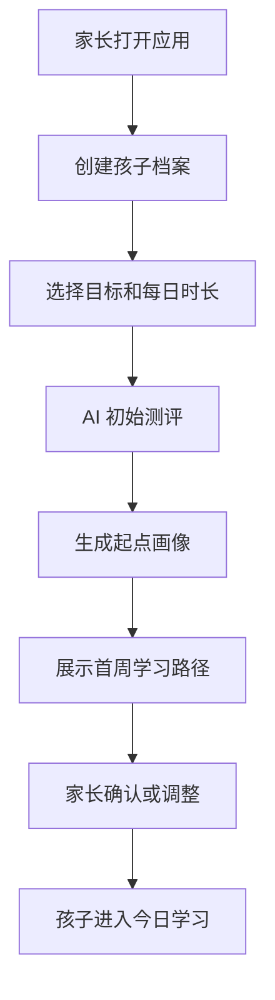
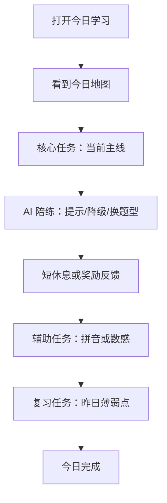
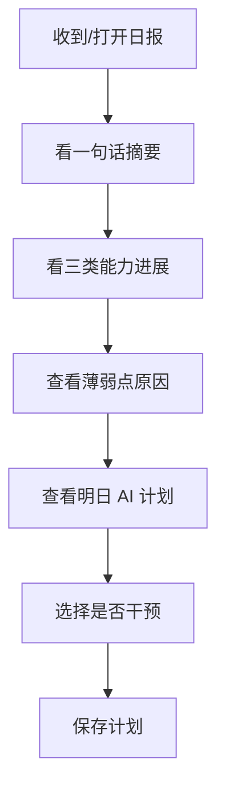

# 幼小衔接 AI 个性化辅导 App PRD V2

版本：V2.0  
日期：2026-06-20  
适用工程：`ai-tutor-nextjs`  
产品形态：iPad 优先的 Next.js Web/PWA 学习应用  
核心定位：面向 3-6 岁儿童的 AI 学习教练，帮助家长完成“测评、计划、陪练、复习、报告、干预”的每日辅导闭环。

---

## 1. 当前项目上下文

### 1.1 已有工程能力

当前 `ai-tutor-nextjs` 已完成一个可运行原型，覆盖主要页面和演示数据闭环：

| 模块 | 当前实现 |
| --- | --- |
| 技术栈 | Next.js App Router、React、TypeScript、Tailwind CSS 4、Vitest、Playwright |
| 儿童端 | `/learn` 每日旅程、`/learn/tasks/[taskId]` 学习任务、`/learn/complete` 今日完成 |
| 家长端 | `/parent/gate` 家长验证、`/parent/dashboard` 总览、`/parent/knowledge` 知识点详情、`/parent/ai-plan` AI 计划、`/parent/plan` 计划干预、`/parent/reports/[date]` 学情报告 |
| 建档测评 | `/login` 孩子档案、`/assessment` 初始测评 |
| 后台 | `/admin/content` 内容与知识图谱后台演示 |
| API | 今日计划、学习事件同步、学情报告 |
| 算法 | 掌握度更新、复习优先级、新知识选择、日计划生成、报告生成 |
| PWA | Manifest、Service Worker、PWA 注册 |
| 测试 | 单元、组件、E2E、构建验证文档已存在 |

### 1.2 当前产品形态判断

工程目前更像“高保真可运行概念原型”，不是可试用的学习产品：

- 页面完整，但学习内容、学习路径、AI 解释和数据闭环仍主要依赖 demo data。
- 首页视觉方向稳定，儿童端氛围安静、低刺激，适合继续承接。
- 当前主路径默认进入 `/learn`，弱化了家长首次建档、初始测评和计划确认。
- 学习体系以识字为主，拼音和数感更像附属任务，没有独立、连续、可评估的阶段路径。
- AI 感知主要来自“AI 提示”和“推荐原因”文案，尚未形成真实的诊断、调题、复习和报告链路。

### 1.3 当前主要缺口

| 问题 | 当前表现 | 优化方向 |
| --- | --- | --- |
| 学习体系不系统 | 汉字只有少量木字旁示例；拼音只有 l/m、a/o/e 演示；数感只有数量比较 | 建立三条能力线：汉字、拼音、数感，每条有阶段、知识点、题型、掌握规则 |
| 用户路径不明确 | 应用默认进儿童首页；家长建档、测评、计划确认不是强主线 | 重构为“家长设定 -> AI 测评 -> 计划确认 -> 儿童每日学习 -> 家长报告/干预” |
| AI 辅助不明显 | AI 标签存在，但策略固定，缺少因果解释和实时调整 | 将 AI 拆为测评、规划、陪练、复习、报告五类可见能力 |
| 数据闭环不完整 | 学习事件同步只校验 payload；计划和报告使用静态数据 | 建立本地画像、事件日志、掌握度更新、计划重算和报告生成链路 |
| 内容后台不足 | 后台展示题量，但真实数据源只有少量知识点 | 内容包数据结构化，支持题目、知识关系、难度、错误标签、版本发布 |
| 家长信任不足 | 家长能看到报告，但不能理解“为什么这么安排” | 家长端展示 AI 决策依据、可调参数、明日影响预览 |

---

## 2. 产品目标

### 2.1 一句话目标

让孩子每天在 iPad 上独立完成 10-20 分钟系统学习，让家长每天用 1 分钟理解孩子的进展和下一步安排。

### 2.2 核心价值

- 对孩子：打开即学、任务短、反馈温和、不会因为答错受挫。
- 对家长：不用每天亲自备课和陪练，但能看懂进展、薄弱点和明日计划。
- 对产品：把学习事件沉淀为画像，用 AI 形成持续个性化，而不是一次性闯关。

### 2.3 产品原则

- 系统性优先：汉字、拼音、数感都有清晰递进，不把内容堆成随机任务。
- AI 可解释：每次计划、提示、复习都能说明依据。
- 儿童低压力：少分数、少排名、少惩罚，重点是完成感和渐进掌握。
- 家长可控：AI 自动安排，但家长能调节强度、目标和复习范围。
- 服务端优先：儿童学习数据默认写入 MySQL，正常使用依赖在线 API。

---

## 3. 目标用户与使用场景

### 3.1 儿童用户

| 类型 | 特征 | 产品要求 |
| --- | --- | --- |
| 3-4 岁启蒙 | 注意力短，依赖图像、语音和触摸反馈 | 任务更短，以听、看、选、拖拽为主 |
| 4-5 岁中班 | 开始建立字音、字形、数量感 | 需要跨题型重复，但不能像考试 |
| 5-6 岁幼小衔接 | 准备进入小学，需要系统补齐基础 | 需要汉字、拼音、数感三线并进 |

### 3.2 家长用户

| 类型 | 需求 | 产品要求 |
| --- | --- | --- |
| 忙碌型 | 希望应用替代日常陪学 | 默认计划可靠，报告简洁 |
| 高参与型 | 希望掌握细节并调整方向 | 提供知识点详情、计划干预、复习指定 |
| 焦虑型 | 担心孩子落后但不懂教 | 报告克制、具体、行动导向，避免制造焦虑 |

---

## 4. 优化后的用户路径

### 4.1 首次路径



关键要求：

- 首次打开不应直接进入儿童首页，除非已有有效孩子档案和今日计划。
- 初始测评必须覆盖汉字、拼音、数感三线，不是只测单个汉字。
- 测评结束后先给家长看“起点画像 + 今日计划依据”，再交给孩子学习。

### 4.2 儿童每日路径



关键要求：

- 首页从“单一识字首页”升级为“今日学习地图”。
- 今日地图显示 3 类任务：新学、复习、小游戏巩固。
- 每个任务显示“为什么做”：例如“昨天把 林 和 木 混了，今天先复习字形”。
- 儿童端不展示复杂学术概念，使用图标、短句和进度表达。

### 4.3 家长每日路径



关键要求：

- 家长报告要解释“孩子哪里会、哪里不会、AI 明天怎么安排”。
- 家长调整计划后，必须看到影响预览：减少新知识、增加复习、时长变化等。
- 家长不需要懂算法，但要能判断计划是否可信。

---

## 5. 学习体系设计

### 5.1 总体结构

V2 将学习内容拆成三条主线和一条辅助线：

| 能力线 | 目标 | MVP 要求 |
| --- | --- | --- |
| 汉字与词语 | 建立字音、字形、字义、词语应用 | 必须成体系，是 MVP 主线 |
| 拼音与听说 | 建立音素意识、声韵母识别、拼读和跟读 | MVP 轻量成体系，P1 增强语音评分 |
| 数感与数学启蒙 | 建立数量、比较、分合、规律、空间基础 | MVP 做 3 个基础主题，P1 扩展 |
| 专注与习惯 | 记录完成节奏、停顿、提示依赖 | MVP 只用于计划调节，不做独立训练 |

### 5.2 汉字与词语体系

#### 阶段路径

| 阶段 | 能力目标 | 典型题型 | 掌握标准 |
| --- | --- | --- | --- |
| H1 听音识字 | 听到读音能选出字 | 听音选字、听音找卡片 | 正确率 >= 80%，提示少 |
| H2 字形观察 | 能分辨形近字和结构 | 偏旁高亮、结构配对、找不同 | 形近干扰错误下降 |
| H3 字义理解 | 知道字的意思和场景 | 看图选字、字义匹配 | 能稳定匹配图义 |
| H4 词语应用 | 能组成常见词 | 组词、词图匹配、短句填空 | 能在词语中识别目标字 |
| H5 书写感知 | 理解基本笔画和结构 | 描红、笔顺动画、田字格观察 | 不追求漂亮，关注笔顺和结构 |

#### 知识图谱要求

汉字知识点需要包含：

- 基础字段：字、拼音、声调、常见词、图义、适用年龄、难度。
- 结构字段：偏旁、部件、笔画数、结构类型、笔顺资源。
- 关系字段：形似、音似、同主题、先修、可组词、易混淆。
- 教学字段：推荐题型、干扰项策略、错误标签、复习间隔。

MVP 内容规模建议：

- 80-120 个高频基础汉字。
- 每个汉字至少 6-10 道题。
- 每个汉字至少覆盖听音、字形、字义、组词 4 类题型中的 3 类。
- 木、口、人、日、水、火、手、心等基础部件优先。

### 5.3 拼音与听说体系

#### 阶段路径

| 阶段 | 能力目标 | 典型题型 | MVP/P1 |
| --- | --- | --- | --- |
| P1 音素感知 | 能分辨不同声音 | 听音选择、找相同开头音 | MVP |
| P2 单韵母 | 认识 a/o/e/i/u/v 及口型 | 听音选韵母、口型提示 | MVP |
| P3 声母 | 认识 b/p/m/f/d/t/n/l 等 | 声母听辨、声母配图 | MVP |
| P4 声调 | 感知一二三四声 | 声调手势、听音选调 | P1 |
| P5 拼读 | 声母 + 韵母拼读 | 拼读卡片、听音拼合 | P1 |
| P6 跟读 | 跟读并获得温和反馈 | 录音、重听、可选评分 | P1 |

#### 关键原则

- 拼音不应只是识字任务里的读音提示，必须有独立进度。
- 低龄儿童不直接展示高压分数，优先给“已尝试、发音更清楚、需要再听一遍”等反馈。
- 拼音要和汉字互相增强，例如学“林”时关联 `l`、`in`、二声。

### 5.4 数感与数学启蒙体系

#### 阶段路径

| 阶段 | 能力目标 | 典型题型 | MVP/P1 |
| --- | --- | --- | --- |
| M1 点数与基数 | 知道数到最后代表总数 | 点数、数字匹配、实物计数 | MVP |
| M2 数量比较 | 多/少/一样多，数字大小 | 圆片比较、配对比较 | MVP |
| M3 数的分合 | 5 以内、10 以内分解 | 分苹果、凑一凑 | MVP |
| M4 简单加减 | 情境化加减 | 拿走/加入、故事题 | P1 |
| M5 规律排序 | 颜色、形状、数量规律 | 找规律、补下一个 | P1 |
| M6 空间图形 | 上下左右、形状识别 | 拼图、位置选择 | P1 |

#### 关键原则

- 数感不是“做算术”，优先通过实物、图形和比较建立数量理解。
- MVP 不追求题量大，重点要覆盖点数、比较、分合三类基础能力。
- 错误标签需要区分：不会点数、漏数、比较策略错误、数字符号不熟。

### 5.5 每日任务编排

默认 20 分钟日计划建议：

| 任务 | 时长 | 内容 |
| --- | --- | --- |
| 进入与热身 | 1 分钟 | 显示今日目标、AI 简短说明 |
| 主线学习 | 6-8 分钟 | 当日主线，通常为汉字或拼音 |
| 薄弱点复习 | 4-5 分钟 | 昨日或近 7 日高优先级知识点 |
| 数感小游戏 | 4-5 分钟 | 点数、比较、分合等短任务 |
| 今日收束 | 1-2 分钟 | 奖励、总结、明日预告 |

编排规则：

- 新知识占比不超过 40%。
- 复习任务每天必须出现，且由掌握度和遗忘间隔决定。
- 连续错误知识点第二天必须进入复习。
- 孩子疲劳、超时或提示依赖过高时，自动切轻松题型。

---

## 6. AI Agent 能力定义

### 6.1 AI 应该被用户感知到的地方

| Agent 能力 | 用户可见表现 | 当前状态 | V2 要求 |
| --- | --- | --- | --- |
| 测评 Agent | 测完后说明起点和薄弱能力 | 单题演示 | 三线测评并生成画像 |
| 规划 Agent | 解释今天/明天为什么这样学 | 固定原因文案 | 基于事件、掌握度、家长设置生成原因 |
| 陪练 Agent | 答错后分层提示、降级或换题型 | 单个提示文案 | 建立提示阶梯和题型切换 |
| 复习 Agent | 自动安排遗忘复习 | 简单优先级 | 引入掌握度、遗忘间隔、错误类型 |
| 报告 Agent | 给家长输出具体建议 | 静态报告 | 从事件和画像生成动态报告 |
| 内容质检 Agent | 发现异常题目和干扰项问题 | 后台演示 | P1 接入题目正确率、耗时、跳过率 |

### 6.2 陪练提示阶梯

| 触发 | AI 反馈 | 例子 |
| --- | --- | --- |
| 第一次错误 | 温和提醒，不直接给答案 | “再看看两个木是不是站在一起。” |
| 第二次错误 | 给出音/形/义线索 | “林有两个木，表示很多树。” |
| 第三次错误 | 降低难度或换题型 | 从短句填空切回听音选字 |
| 连续答对 | 提升一点难度 | 加入形近干扰项或词语应用 |
| 长时间停顿 | 询问是否换玩法 | “要不要先听一遍，或者换成找图片？” |

### 6.3 AI 解释模板

儿童端解释要短：

- “昨天容易混，今天先复习。”
- “你已经会读了，今天试试组词。”
- “今天轻松一点，只做熟悉的题。”

家长端解释要具体：

- “林 的掌握度 64%，近 3 次有 2 次字形混淆，因此明天先复习 木/林/森 的结构关系。”
- “拼音 l/m 听辨反应时间偏长，但正确率稳定，建议保留 4 分钟听说练习。”
- “数感比较题正确率 80% 以上，明天保持轻量巩固，不增加新难度。”

---

## 7. 功能需求

### 7.1 家长建档

目标：建立孩子基础画像和家长期望。

要求：

- 字段包括昵称、年龄阶段、每日时长、学习目标、已有基础、家长偏好。
- 支持匿名家长账号建档；孩子档案和学习数据写入服务端 MySQL。
- 建档完成后进入初始测评，而不是直接进入儿童首页。
- 已有档案时，应用启动可直接进入今日学习。

验收：

- 家长能在 2 分钟内完成建档。
- 建档字段会进入计划生成输入。

### 7.2 初始测评

目标：确定三线学习起点。

要求：

- 测评控制在 6-8 分钟，最多 12-15 道题。
- 汉字：听音选字、看图识字、形近辨认。
- 拼音：听音辨别、单韵母/声母识别。
- 数感：点数、数量比较、5 以内分合。
- 记录正确率、响应时间、提示次数、跳过、错误类型。
- 生成起点画像和首周路径。

验收：

- 测评结束能给出汉字、拼音、数感三个起点等级。
- 首日计划由测评结果生成，不再只使用固定 demo plan。

### 7.3 儿童首页：今日学习地图

目标：让孩子知道今天做什么，让家长看得出 AI 为什么安排。

要求：

- 顶部显示问候、今日总时长、家长入口。
- 主区域显示今日主线，例如“认识木字旁朋友”。
- 任务区显示新学、复习、数感小游戏三类任务。
- 每个任务显示预计时长、完成状态和一句 AI 原因。
- 支持从未完成任务继续。

验收：

- 儿童能一键开始今日任务。
- 页面不再只表达“识字”单一主线，而是体现三线学习安排。

### 7.4 学习任务播放器

目标：统一承载汉字、拼音、数感题型和 AI 陪练。

要求：

- 接收结构化题目，不再按任务类型写死题面。
- 支持题型：听音选字、看图识字、字形观察、组词、描红、听音辨别、跟读、点数、数量比较、数的分合。
- 每题记录学习事件。
- AI 提示根据错误次数、错误类型和停顿触发。
- 任务完成后更新掌握度，并决定是否进入下一题或收束。

验收：

- 同一个播放器能渲染至少 6 类题型。
- 答错 3 次会触发降级或换题型。
- 完成任务后本地画像发生变化。

### 7.5 AI 学习计划

目标：生成可解释、可干预的每日计划。

输入：

- 孩子档案、测评结果、知识点掌握度、学习事件、内容包、家长设置。

输出：

- 今日任务列表、知识点、题型、预计时长、难度、推荐原因。

规则：

- 优先安排低掌握度、高遗忘风险、连续错误知识点。
- 每天保持至少 1 个成功率较高的任务，避免挫败。
- 家长开启轻松模式时，减少新知识并提升已掌握内容比例。
- 家长指定复习时，指定知识点进入明日计划，但不能完全破坏难度平衡。

验收：

- 计划解释能追溯到具体数据。
- 家长调整后，计划预览实时变化并可保存。

### 7.6 家长报告

目标：用 1 分钟解释学习进展和下一步。

要求：

- 今日一句话。
- 三线能力概览：汉字、拼音、数感。
- 今日完成：时长、任务数、正确率、提示次数。
- 薄弱点：知识点、错误类型、可能原因、明日安排。
- 明日计划：任务、时长、AI 原因。
- 家长建议：最多 2 条，具体可执行。

验收：

- 报告不能只展示静态文案。
- 每条薄弱点都能看到对应学习事件或掌握度依据。

### 7.7 内容与知识图谱后台

目标：支持系统化学习内容和算法输入。

要求：

- 知识点管理：汉字、拼音、数感概念。
- 题目管理：题型、答案、干扰项、素材、难度、错误标签。
- 关系管理：先修、形似、音似、主题、组词、能力依赖。
- 内容包管理：版本、灰度、回滚、静态资源。
- 数据看板：题目正确率、平均耗时、提示率、跳过率、异常题目。

验收：

- MVP 至少能用 JSON/静态内容包驱动前台题目。
- P1 再做完整可视化后台编辑。

---

## 8. 数据与算法需求

### 8.1 核心数据模型

| 模型 | 关键字段 |
| --- | --- |
| ChildProfile | childId, name, ageBand, stage, dailyMinutes, goals, parentPreferences |
| KnowledgeNode | id, domain, title, difficulty, prerequisites, relations, tags |
| ContentItem | itemId, knowledgeIds, type, prompt, choices, answer, assets, difficulty, errorTags |
| MasteryRecord | knowledgeId, masteryScore, exposureCount, correctCount, wrongCount, hintCount, lastPracticedAt, nextReviewAt, weaknessTags |
| LearningEvent | eventId, childId, sessionId, taskId, itemId, eventType, answer, isCorrect, durationMs, hintCount, errorTags |
| DailyPlan | planId, childId, date, tasks, reasons, status, parentOverrides |
| Report | reportId, childId, date, summary, strengths, weaknesses, tomorrowPlan |

### 8.2 掌握度维度

V2 不只看正确率，还要综合：

- 正确率：是否答对。
- 反应时间：是否明显犹豫。
- 提示依赖：是否靠提示完成。
- 错误类型：音混、形混、义混、点数错误、比较错误等。
- 遗忘间隔：距离上次练习多久。
- 迁移能力：能否从选择题进入组词/应用题。

### 8.3 复习优先级

建议公式方向：

```text
reviewPriority =
  lowMasteryWeight +
  forgettingWeight +
  recentErrorWeight +
  hintDependencyWeight +
  parentBoost -
  fatiguePenalty
```

规则：

- 掌握度低于 70 的知识点优先复习。
- 连续错误或提示次数高的知识点优先复习。
- 已经掌握但超过复习间隔的知识点进入轻量复习。
- 当日任务不能全部由薄弱点组成，需要保留成功体验。

---

## 9. 工程优化优先级

以下是基于当前 `ai-tutor-nextjs` 工程的建议改造顺序。

### 9.1 P0：让原型变成清晰产品闭环

| 优先级 | 改造项 | 涉及位置 |
| --- | --- | --- |
| P0-1 | 启动路由根据是否有档案/计划决定去 `/login` 或 `/learn` | `src/app/page.tsx` |
| P0-2 | 替换默认 README，写清项目定位、运行方式、页面范围 | `README.md` |
| P0-3 | 首页从单一“识字”改为“今日学习地图” | `src/app/learn/page.tsx` |
| P0-4 | 初始测评覆盖汉字、拼音、数感，生成结果页/计划确认 | `src/app/assessment/page.tsx` |
| P0-5 | 任务播放器改为题目数据驱动 | `src/components/client/task-practice.tsx` |
| P0-6 | 将 demo data 拆为内容包、画像、计划、报告 | `src/lib/demo-data.ts` |

### 9.2 P1：让 AI 辅助真正可见

| 优先级 | 改造项 | 涉及位置 |
| --- | --- | --- |
| P1-1 | 学习事件写入 MySQL 事件日志，驱动掌握度更新 | `src/app/api/learning/events/route.ts`、MySQL |
| P1-2 | 日计划根据画像动态生成，并输出可解释原因 | `src/lib/learning-engine.ts` |
| P1-3 | 家长计划调整持久化，影响明日计划 | `src/components/client/plan-editor.tsx` |
| P1-4 | 报告从事件和掌握度生成，不使用静态文案 | `src/app/parent/reports/[date]/page.tsx` |
| P1-5 | AI 提示阶梯、降级、换题型 | `src/components/client/task-practice.tsx` |

### 9.3 P2：内容系统和规模化

| 优先级 | 改造项 | 说明 |
| --- | --- | --- |
| P2-1 | 建立汉字、拼音、数感内容 JSON schema | 先静态文件，后接后台 |
| P2-2 | 扩展 MVP 内容包到 80-120 汉字、基础拼音、数感三主题 | 支撑真实试用 |
| P2-3 | 后台支持题目异常数据 | 依据正确率、耗时、提示率发现问题 |
| P2-4 | 语音跟读能力接入 | P1/P2 视供应商能力决定 |

---

## 10. MVP 范围重定义

### 10.1 MVP 必须包含

| 模块 | 要求 |
| --- | --- |
| 家长建档 | 孩子基础信息、目标、时长、账号与数据保存 |
| 初始测评 | 汉字、拼音、数感三线测评 |
| 起点画像 | 三线等级、薄弱点、首周目标 |
| 今日学习地图 | 新学、复习、数感小游戏、AI 原因 |
| 汉字主线 | 80-120 个基础字内容包，至少 4 类题型 |
| 拼音轻量主线 | 单韵母、基础声母、听辨练习 |
| 数感基础主线 | 点数、比较、5 以内分合 |
| AI 陪练 | 提示阶梯、降级/换题型、薄弱点记录 |
| 日计划 | 根据画像和事件生成，并可解释 |
| 家长报告 | 三线概览、薄弱点、明日计划 |
| 家长干预 | 轻松模式、暂停新知识、调整时长、指定复习 |
| 本地数据 | 事件日志、掌握度、本地计划 |

### 10.2 MVP 暂不做

- 开放式儿童聊天机器人。
- 陌生人社交、排行榜、班级 PK。
- 大规模老师端和机构版。
- 强发音打分和诊断。
- 复杂后台可视化编辑器。
- 付费、订单、会员体系。

---

## 11. 核心验收标准

### 11.1 产品验收

- 家长首次使用能完成建档、测评、查看起点画像、确认计划。
- 孩子能从今日学习地图完成至少 3 个任务。
- 汉字、拼音、数感都能看到独立进度，不再只有识字主线。
- 答错后的 AI 反馈至少包含三层：提醒、线索、降级/换题型。
- 家长报告能解释“为什么明天这样安排”。
- 家长调整计划后，明日计划发生可见变化。

### 11.2 数据验收

- 每次答题都会产生 `item_answered` 事件。
- 每个任务完成都会更新相关知识点掌握度。
- 每日计划能读取前一天学习事件。
- 报告中的薄弱点能追溯到错误事件或掌握度记录。
- 正常在线学习事件能实时写入服务端，并通过 `clientEventId` 避免重复提交。

### 11.3 内容验收

- 汉字内容包至少 80 个字。
- 每个汉字至少 6 道题，覆盖至少 3 种题型。
- 拼音 MVP 覆盖 6 个单韵母和 8 个基础声母。
- 数感 MVP 覆盖点数、比较、5 以内分合。
- 每道题都有知识点、题型、难度、答案、错误标签。

### 11.4 体验验收

- 儿童主流程按钮点击区域不小于 48px。
- 单任务控制在 3-8 分钟。
- 页面文字短句化，儿童端不依赖长段阅读。
- 错误反馈不使用大面积红色和挫败性文案。
- 首页、任务页、完成页在 iPad 横屏下无明显遮挡、溢出。

---

## 12. 里程碑建议

| 阶段 | 时间 | 目标 |
| --- | --- | --- |
| M0 产品重整 | 1 周 | 确认 V2 PRD、学习体系、内容 schema、信息架构 |
| M1 闭环改造 | 2 周 | 首次路径、今日地图、题目播放器、事件日志 |
| M2 内容体系 | 2-3 周 | 汉字、拼音、数感 MVP 内容包和题型覆盖 |
| M3 AI 可解释 | 2 周 | 动态计划、提示阶梯、报告生成、家长干预持久化 |
| M4 试用准备 | 1-2 周 | QA、性能、MySQL 数据校验、家长试用反馈 |

---

## 13. 待确认问题

- 首批内容是否已有外部教材、字表、拼音表或数学能力表可复用。
- MVP 是否必须包含语音录音和跟读，还是先用听辨与手动跟读替代。
- 家长账号是否先用匿名账号，还是 MVP 直接接入真实登录。
- 是否需要保留当前“识字主视觉”作为首页主视觉，还是升级成三线学习地图。
- 内容后台是 MVP 需要可编辑，还是先用 JSON 内容包加校验脚本。
- AI 计划是否允许接入真实模型，还是先用规则引擎模拟并保留接口。

---

## 14. 下一步建议

建议按以下顺序推进：

1. 确认本 PRD V2 的学习体系和 MVP 范围。
2. 先设计内容 schema，再改任务播放器，否则后续题型会继续写死在组件里。
3. 重构首页为今日学习地图，解决用户路径和三线学习可见性。
4. 接入本地事件日志和掌握度更新，让 AI 计划与报告脱离静态 demo。
5. 扩充首批内容包，开始可用性试用。
